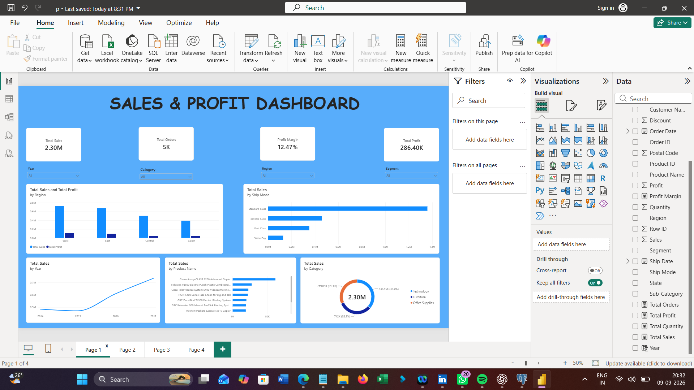
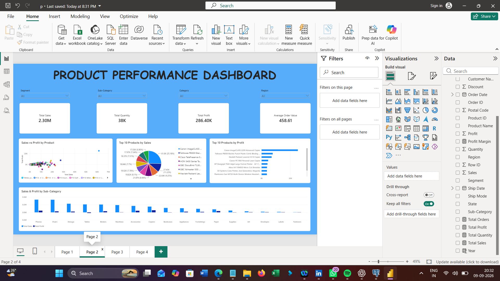
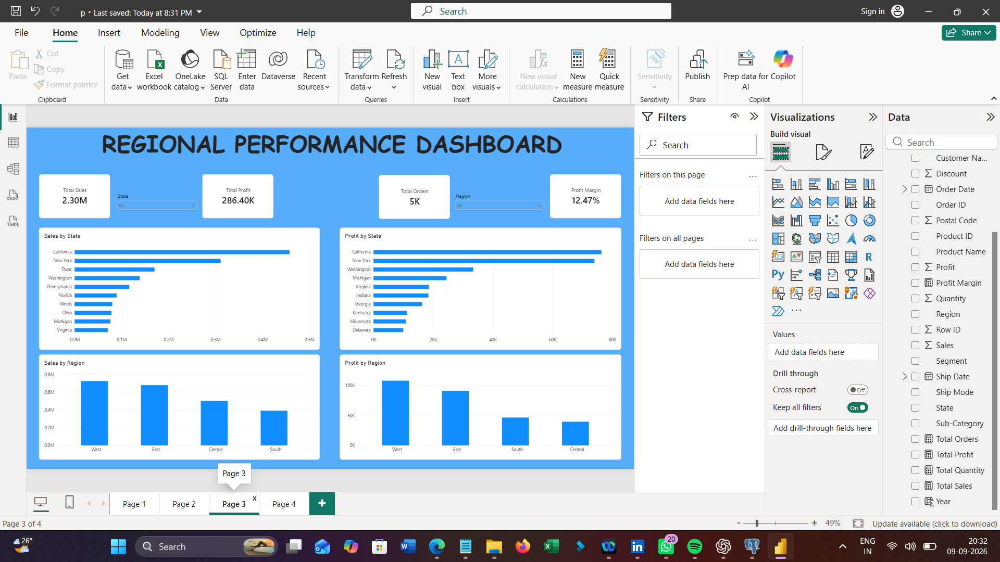
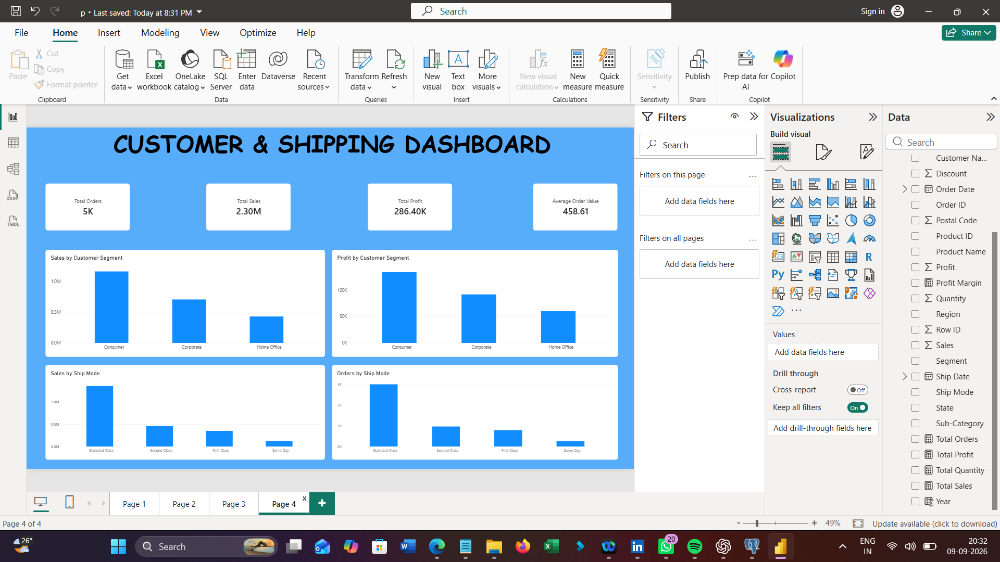

# 📊 Superstore Sales Analysis — Power BI Dashboard

## 📌 Project Overview

This project analyzes the **Superstore sales dataset** to understand overall business performance, sales trends, profitability, product performance, regional performance, customer segments, and shipping methods.

The project combines **SQL analysis and Power BI visualization** to transform raw sales data into meaningful business insights through an interactive dashboard.

---

## 🎯 Business Problem

A retail business needs to understand:

* How much revenue is being generated?
* Which products and categories perform best?
* Which regions generate the most sales and profit?
* Which customer segments contribute the most revenue?
* Which shipping methods are most commonly used?
* Where are opportunities to improve profitability?

This project addresses these questions using data analysis and interactive Power BI dashboards.

---

## 🎯 Project Objectives

* Analyze overall sales and profitability
* Identify high-performing products
* Compare category and sub-category performance
* Analyze regional and state-level performance
* Understand customer segment contribution
* Evaluate shipping method performance
* Track key business KPIs
* Build an interactive Power BI dashboard
* Generate actionable business insights

---

## 🗂️ Dataset

**Dataset:** Superstore Sales Dataset

The dataset contains information about:

* Orders
* Customers
* Products
* Categories
* Regions
* States
* Sales
* Quantity
* Discounts
* Profit
* Shipping methods

### Main Columns

``text
Row ID
Order ID
Order Date
Ship Date
Ship Mode
Customer ID
Customer Name
Segment
Country
City
State
Postal Code
Region
Product ID
Category
Sub-Category
Product Name
Sales
Quantity
Discount
Profit
```


## 🛠️ Tools & Technologies

| Tool       | Purpose                                   |
| ---------- | ----------------------------------------- |
| PostgreSQL | Data storage and SQL analysis             |
| SQL        | Data analysis and business queries        |
| Power BI   | Dashboard and visualization               |
| DAX        | KPI and calculated measures               |
| Excel      | Data inspection and preparation           |
| GitHub     | Project documentation and version control |

---

## 🔄 Project Workflow

```text
Raw Dataset
     ↓
Data Preparation
     ↓
PostgreSQL Database
     ↓
SQL Analysis
     ↓
DAX Measures
     ↓
Power BI Dashboard
     ↓
Business Insights
```

---

# 🧹 Data Preparation

The Superstore dataset was imported into PostgreSQL and prepared for analysis.

The data preparation process included:

* Importing the CSV dataset
* Checking column names and data types
* Handling date fields
* Checking for duplicate records
* Validating numerical fields
* Checking sales and profit values
* Preparing the dataset for SQL analysis and Power BI

---

# 🧮 SQL Analysis

SQL was used to analyze the dataset and calculate important business metrics.

### Example: Overall Business Performance

```sql
SELECT
    SUM(sales) AS total_sales,
    SUM(profit) AS total_profit,
    COUNT(DISTINCT order_id) AS total_orders
FROM superstore;
```

### SQL Analysis Included

* Overall sales and profit
* Total orders
* Regional performance
* Category performance
* Sub-category performance
* Product performance
* Customer segment analysis
* Shipping mode analysis
* Profitability analysis

---

# 📐 DAX Measures

The following DAX measures were created in Power BI.

### Total Sales

```DAX
Total Sales = SUM(superstore[sales])
```

### Total Profit

```DAX
Total Profit = SUM(superstore[profit])
```

### Total Orders

```DAX
Total Orders = DISTINCTCOUNT(superstore[order_id])
```

### Total Quantity

```DAX
Total Quantity = SUM(superstore[quantity])
```

### Profit Margin

```DAX
Profit Margin = DIVIDE([Total Profit], [Total Sales], 0)
```

### Average Order Value

```DAX
Average Order Value = DIVIDE([Total Sales], [Total Orders], 0)
```

---

# 📊 Power BI Dashboard

The project contains **4 interactive dashboard pages**.

## 1️⃣ Sales & Profit Dashboard

**Purpose:** Analyze overall business performance.

### KPIs

* Total Sales
* Total Orders
* Total Profit
* Profit Margin

### Analysis

* Sales and profit trends
* Sales by category
* Sales by product
* Yearly sales performance
* Interactive filtering by date, category, region, and segment

---

## 2️⃣ Product Performance Dashboard

**Purpose:** Understand product, category, and sub-category performance.

### KPIs

* Total Sales
* Total Profit
* Total Quantity
* Average Order Value

### Analysis

* Top 10 products by sales
* Top 10 products by profit
* Sales and profit by sub-category
* Sales vs. profit by product
* Category and sub-category filtering

---

## 3️⃣ Regional Performance Dashboard

**Purpose:** Compare sales and profitability across different regions and states.

### KPIs

* Total Sales
* Total Profit
* Total Orders
* Profit Margin

### Analysis

* Sales by region
* Profit by region
* Sales by state
* Profit by state
* Region and state filtering

---

## 4️⃣ Customer & Shipping Dashboard

**Purpose:** Analyze customer segments and shipping performance.

### KPIs

* Total Sales
* Total Profit
* Total Orders
* Average Order Value

### Analysis

* Sales by customer segment
* Profit by customer segment
* Sales by shipping mode
* Orders by shipping mode

---

# 📈 Key Business Metrics

| Metric        |    Value |
| ------------- | -------: |
| Total Sales   | ₹22.97 L |
| Total Profit  |  ₹2.86 L |
| Total Orders  |    5,009 |
| Profit Margin |   12.47% |

---

# 💡 Key Business Insights

* The business generated approximately **₹22.97 lakh in total sales** across **5,009 orders**.
* Total profit was approximately **₹2.86 lakh**, giving an overall profit margin of **12.47%**.
* Product-level analysis helps identify products contributing strongly to sales and profitability.
* Regional analysis highlights differences in sales and profit performance across markets.
* Customer segment analysis helps identify the major contributors to overall revenue.
* Shipping analysis shows the distribution of orders and sales across different shipping methods.
* Comparing sales with profit helps identify areas where high revenue does not necessarily result in high profitability.

---

# 📌 Business Recommendations

Based on the analysis, the business can:

* Focus on high-profit products and sub-categories.
* Investigate products with high sales but comparatively low profit.
* Review discount strategies where profitability is weak.
* Focus on strong-performing regions while improving weaker markets.
* Develop strategies to retain high-value customer segments.
* Monitor shipping methods to balance customer service and operational efficiency.

---

# 🖥️ Dashboard Preview

### Sales & Profit Dashboard



### Product Performance Dashboard



### Regional Performance Dashboard



### Customer & Shipping Dashboard



---

# 📁 Project Structure

``text
superstore-sales-analysis/
│
├── README.md
│
├── data/
│   └── SampleSuperstore.csv
│
├── sql/
│   └── superstore_analysis.sql
│
├── powerbi/
│   └── Superstore_Sales_Analysis.pbix
│
├── screenshots/
│   ├── sales-profit-dashboard.png
│   ├── product-performance.png
│   ├── regional-performance.png
│   └── customer-shipping.png
│
└── documentation/
    └── project-report.pdf
```

---

# 🚀 How to Explore the Project

1. Download the repository.
2. Open the SQL file to review the analysis queries.
3. Open the .pbix file using Power BI Desktop.
4. Explore the four dashboard pages.
5. Use the available slicers to interact with the data.
6. Review the business insights and recommendations.

---

# 📚 Skills Demonstrated

Through this project, I demonstrated practical knowledge of:

* SQL
* PostgreSQL
* Data Cleaning
* Data Analysis
* DAX
* Power BI
* Data Visualization
* KPI Development
* Business Intelligence
* Business Insights
* GitHub Documentation

---

# 👨‍💻 Author

**Navaneeth**

B.Tech Computer Science & Engineering

**Aspiring Data Analyst**

Skills: SQL | Power BI | Excel | Python | Data Analysis

---

⭐ If you find this project useful, feel free to explore the repository and dashboard.
